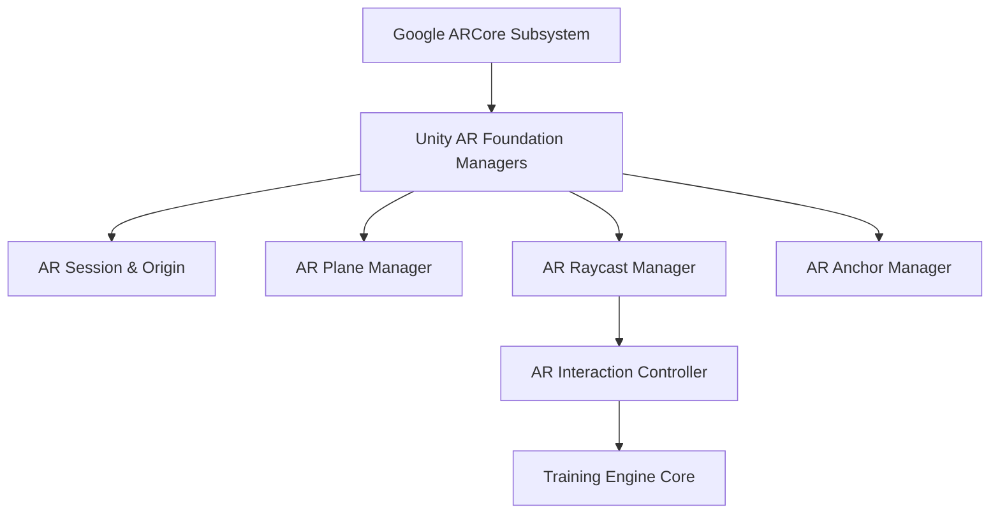

# SurakshaAR — AR Layer Architecture Specification

## 1. System Responsibilities
The **AR Layer** serves as the spatial interface between the physical world and virtual industrial safety equipment. Built on **Unity AR Foundation** and **Google ARCore XR Plugin**, it provides robust surface tracking and object interaction tailored for mid-range Android devices.

---

## 2. Core AR Components

### 2.1 AR Session & Origin Management
- **`ARSession`:** Controls the lifecycle of the AR experience (Initialization, Pausing, Resuming, Resetting).
- **`XROrigin`:** Transforms AR trackable coordinates into Unity world space. Scales virtual cameras to match physical device movement.

### 2.2 Plane Detection & Floor Anchoring
- **Detection Modes:** Horizontal planes (floors, desk surfaces) prioritized for equipment placement; Vertical planes (walls) for fire alarms & exit signs.
- **Surface Verification:** Displays a low-overhead dot-matrix plane visualizer during initial surface scan phase.

### 2.3 Raycasting & Object Placement
- **`ARRaycastManager`:** Executes screen-point raycasts against detected trackables (`TrackableType.PlaneWithinPolygon`).
- **Placement Controller:** Ensures 3D equipment (Extinguishers, Alarms, Gas Detectors) grounds smoothly on physical floors without clipping.

### 2.4 Anchoring Strategy
- **`ARAnchorManager`:** Attaches `ARAnchor` components to placed objects, preventing spatial drift during long training sessions.

---

## 3. Mid-Range Android Performance Strategy

Target hardware: Android 10+ (API 29+), Snapdragon 680 / Helio G99 / Exynos 1280 or equivalent with 4GB+ RAM.

| Performance Metric | Strategy / Optimization |
| :--- | :--- |
| **Frame Rate** | Locked 60 FPS target (30 FPS minimum threshold) |
| **Polygon Count** | Max 15,000 tris per active 3D object prefab |
| **Texture Memory** | 1024x1024 compressed ASTC/ETC2 textures |
| **Plane Limit** | Limit active plane tracking to maximum 8 nearest surfaces |
| **Lighting** | Unlit or Lightweight Mobile Custom Shaders (No real-time shadows, baked ambient occlusion) |
| **Thermal Budget** | Auto-dim UI background and disable plane search once objects are anchored |

---

## 4. Interaction Patterns

1. **Tap-to-Place / Tap-to-Interact:** Single tap screen raycast to select or operate equipment.
2. **Aim & Discharge:** Touch-and-hold spatial vector targeting for fire extinguisher operation.
3. **Proximity Trigger:** Virtual player camera enters 3D bounding volume (e.g., Safe Evacuation Corridor or Assembly Point).
