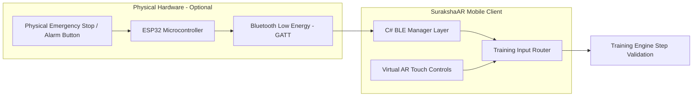

# SurakshaAR — Hardware & IoT Integration Scope

## 1. Optional Hardware Mandate

> **CRITICAL RULE:** Physical hardware integration (ESP32, BLE sensors) is an **OPTIONAL ENHANCEMENT**. The core SurakshaAR mobile application must remain 100% functional via Android touch & AR interactions without requiring any external hardware.

---

## 2. Supported Hardware Scenarios



### 2.1 Hardware Prototypes
- **Physical Emergency Push Button:** ESP32 module with a physical red industrial emergency button. Pressing the button sends a GATT signal `0x01` over BLE to trigger the `RAISE_ALARM` step in the AR simulation.
- **Physical Gas Detector Shell (Optional):** ESP32 housed in a dummy 3D-printed gas detector with a potentiometer to simulate gas level readings wirelessly.

---

## 3. Graceful Fallback Logic

```csharp
// Conceptual Input Router Logic
public void OnAlarmTriggered() 
{
    if (isBLEConnected && bleEventReceived) 
    {
        TrainingEngine.Instance.ProcessAction(ActionType.RAISE_ALARM, Source.PHYSICAL_HARDWARE);
    } 
    else 
    {
        // Standard AR Touch Input Fallback
        TrainingEngine.Instance.ProcessAction(ActionType.RAISE_ALARM, Source.VIRTUAL_AR_TOUCH);
    }
}
```
