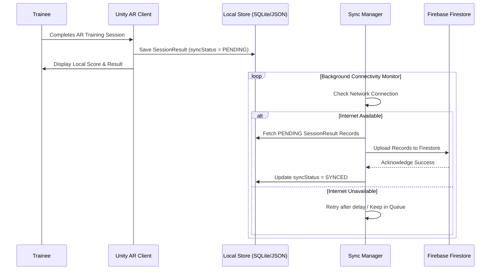

# SurakshaAR — Offline-First Architecture Specification

## 1. Core Mandate
Mining sites and industrial facilities often lack reliable cellular or Wi-Fi internet connectivity. **SurakshaAR** is built with an strict **Offline-First** architecture:

> **Zero Cloud Dependency During Simulation:** The core AR simulation, step validation, scoring, and local result display must run 100% locally on the Android device without active internet connection.

---

## 2. Sync Data Flow Architecture



---

## 3. Storage Layer Specifications

### 3.1 Local Storage Location
- **Android Path:** `Application.persistentDataPath` (`/storage/emulated/0/Android/data/com.suraksha.ar/files/`)
- **Format:** SQLite database (`suraksha_local.db`) for structured query performance, with JSON backup export for fallback.

### 3.2 Sync Queue Table Schema

```sql
CREATE TABLE PendingSync (
    id TEXT PRIMARY KEY,
    dataType TEXT NOT NULL, -- 'SESSION_RESULT', 'WORKER_UPDATE'
    payloadJson TEXT NOT NULL,
    createdTimestamp INTEGER NOT NULL,
    retryCount INTEGER DEFAULT 0,
    syncStatus TEXT DEFAULT 'PENDING' -- 'PENDING', 'FAILED', 'SYNCED'
);
```

---

## 4. Offline Certificate Generation
- When a trainee successfully completes assessment mode offline, the app locally generates a cryptographically signed QR code string using SHA-256 hash of `(workerId + moduleId + score + timestamp + localSalt)`.
- The certificate is stored locally for viewing and marked `PENDING_SERVER_VERIFICATION`. Upon cloud synchronization, the web backend validates the hash signature and marks it `SERVER_VERIFIED`.
