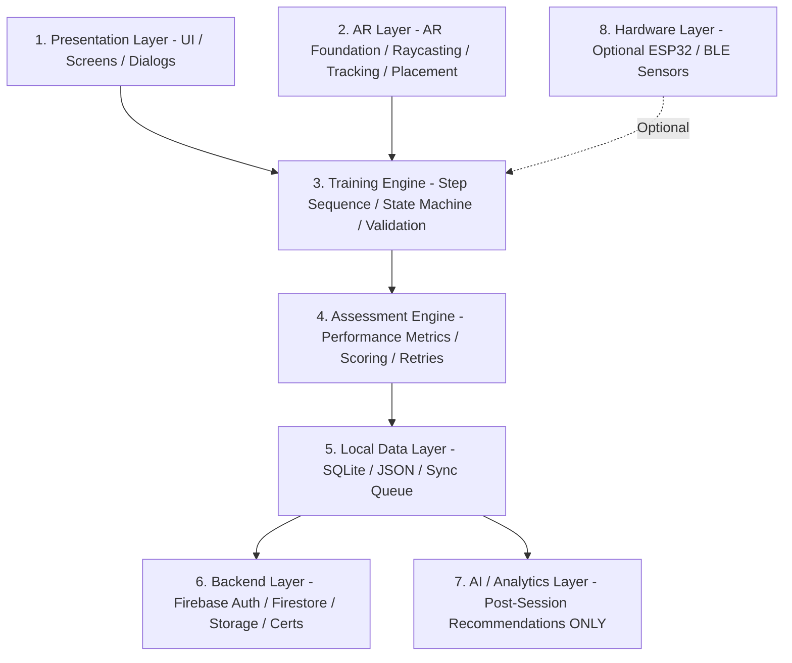

# SurakshaAR — Project Architecture Specification

## 1. System Overview & Objectives
**SurakshaAR** is an Android AR-based industrial safety vocational training simulator tailored for the Jharkhand mining and manufacturing sector.

### Core Objectives:
- **Immersive Vocational Training:** Replace static paper manuals and generic MCQ quizzes with hands-on, 3D spatial AR simulations.
- **Realistic Safety Procedures:** Guide trainees through real-world emergency responses (Fire & Gas Leaks) using contextual 3D interactions on mid-range Android smartphones.
- **Offline-First Resilience:** Ensure full simulation and local scoring operate without internet access in remote mine sites and subterranean environments.
- **Deterministic & Safe Evaluation:** Guarantee safety-critical procedures are governed by verified, rule-based training engines rather than non-deterministic AI.

---

## 2. 8-Layer System Architecture



### Layer Details:
1. **Presentation Layer (UI):** Main Menu, HUD, Instruction Overlays, AR Target Markers, Performance Summary, Certificate Viewer.
2. **AR Layer:** Wraps Unity AR Foundation. Manages AR Session, plane detection, raycasting, object anchoring, hit testing, and gesture interactions.
3. **Training Engine:** Manages active training state, checks action validity, triggers adaptive hints, and controls scenario progression.
4. **Assessment Engine:** Collects objective telemetry (timestamps, mistakes, retries, help used) and computes final scores.
5. **Local Data Layer:** Manages local persistent storage (JSON/SQLite). Queues session records when offline.
6. **Backend Layer:** Firebase Authentication, Firestore synchronization, Cloud Storage, and Certificate verification API.
7. **AI / Analytics Layer:** Asynchronous post-session analyzer that generates personalized training feedback and weak-area reports.
8. **Hardware Integration Layer (Optional):** BLE manager to interface optional ESP32 physical emergency buttons or gas sensors.

---

## 3. Recommended Unity Folder Structure

```
Assets/
└── _Project/
    ├── Art/
    │   ├── Materials/
    │   ├── Models/
    │   │   ├── Environment/
    │   │   ├── Equipment/
    │   │   └── Characters/
    │   ├── Textures/
    │   └── VFX/
    ├── Audio/
    │   ├── SFX/
    │   └── Voiceovers/
    │       ├── EN/
    │       ├── HI/
    │       └── SAT/
    ├── Prefabs/
    │   ├── AR/
    │   ├── Training/
    │   │   ├── Extinguishers/
    │   │   ├── GasDetectors/
    │   │   └── Hazards/
    │   ├── UI/
    │   └── Environment/
    ├── Scenes/
    │   ├── Bootstrap.unity
    │   ├── MainMenu.unity
    │   ├── FireModule.unity
    │   └── GasModule.unity
    ├── Scripts/
    │   ├── Core/
    │   ├── AR/
    │   ├── Training/
    │   ├── Assessment/
    │   ├── UI/
    │   ├── Data/
    │   ├── Localization/
    │   ├── Firebase/
    │   ├── Certification/
    │   ├── AI/
    │   └── IoT/
    ├── ScriptableObjects/
    │   ├── Training/
    │   ├── Scenarios/
    │   └── Configuration/
    ├── Localization/
    └── Resources/
```

---

## 4. Technology Stack Summary

| Component | Selected Technology | Role |
| :--- | :--- | :--- |
| **Engine** | Unity 6.3 LTS (`6000.3.23f1`) | Core 3D Rendering & Application Runtime |
| **AR Framework** | Unity AR Foundation + ARCore XR Plugin | Plane Detection, Raycasting, Anchor Tracking |
| **Target Platform** | Android 10+ (API 29+) | Mid-range smartphones (Snapdragon 680 / Helio G99 equivalent or higher) |
| **Programming Language** | C# (.NET Standard 2.1) | Simulation logic & engine development |
| **Local Persistence** | Newtonsoft.Json / SQLite | Offline session storage & config management |
| **Backend & Cloud** | Firebase (Auth, Firestore, Cloud Storage) | Synchronization, User Profiles, Admin Analytics |
| **Web Admin Dashboard** | React + Firebase SDK | Trainee management, report viewing, verification |
| **3D Assets** | Blender (Low-poly optimized) | Mobile-friendly 3D hazard & safety models |
