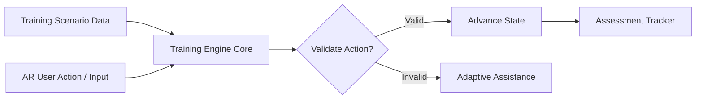
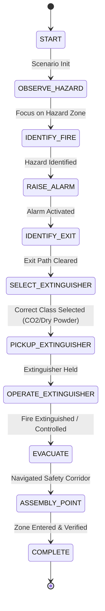

# SurakshaAR — Training Engine Design Specification

## 1. Core Concept & Reusability
The **Training Engine** is a data-driven, state-machine-based execution engine. It governs scenario progression, validates user AR interactions, manages retries, and triggers adaptive assistance.

### Key Principle:
**Zero Hard-Coded Scenarios.** The engine reads `TrainingScenarioSO` (ScriptableObject / JSON) configurations. The exact same execution engine runs Module 1 (Fire), Module 2 (Gas Leak), and future industrial safety scenarios without code modifications.

---

## 2. Training Step Architecture

Each step in a scenario is defined by a standard data schema:

- **stepId:** Unique string identifier (e.g., `FIRE_STEP_03_RAISE_ALARM`)
- **instructionKey:** Localization key for HUD instruction text
- **targetTag / targetId:** 3D AR object tag required for action
- **expectedActionType:** Action classification (`TAP`, `DRAG_AND_DROP`, `AIM_AND_HOLD`, `SELECT_EQUIPMENT`, `ZONE_ENTER`)
- **validationRule:** Condition required to pass step
- **maxAllowedRetries:** Number of failed attempts before escalating help
- **scoringWeight:** Point value contributed towards total score (e.g., 100 pts)

---

## 3. Fire & Explosion Module — State Machine

### State Breakdown Table

| State ID | Expected Action | Valid Target | Validation Rule | Incorrect Action Handling | Assistance Escalation | Score Weight |
| :--- | :--- | :--- | :--- | :--- | :--- | :---: |
| `OBSERVE_HAZARD` | Scan room / locate hazard | `Hazard_Area_01` | Raycast hits hazard zone for > 2 sec | Prompt user to inspect area | Highlight hazard zone | 50 |
| `IDENTIFY_FIRE` | Tap fire hazard marker | `Fire_Origin_Marker` | Tap registered on fire source | Display "Select the fire origin" | Show pulsing arrow | 50 |
| `RAISE_ALARM` | Pull manual call point / press alarm | `Fire_Alarm_MCP` | Direct AR interaction on alarm button | Warn "Alarm not raised!" | Highlight alarm in red | 100 |
| `IDENTIFY_EXIT` | Locate emergency exit sign | `Emergency_Exit_Door` | Raycast / Tap exit door prefab | "Look for green exit signs" | Show floor path arrows | 100 |
| `SELECT_EXTINGUISHER` | Choose correct extinguisher type | `Extinguisher_Rack` | Select CO2/Dry Powder (Not Water for electrical fire) | Warn "Wrong extinguisher type for electrical fire!" | Highlight correct unit | 150 |
| `PICKUP_EXTINGUISHER` | Tap & equip extinguisher | `Selected_Extinguisher` | Item equipped in virtual hands HUD | "Pick up extinguisher" | Show pickup prompt | 100 |
| `OPERATE_EXTINGUISHER` | PASS rule (Pull pin, Aim, Squeeze, Sweep) | `Fire_Base_Target` | Aim at base of fire & hold discharge 5s | Warn "Aim at the BASE of the flame, not top!" | Show sweep trajectory | 250 |
| `EVACUATE` | Walk along safe corridor | `Evacuation_Path` | Stay within green safe vector | "Stay clear of smoke cloud" | Show safe path bounds | 100 |
| `ASSEMBLY_POINT` | Move to outdoor assembly point | `Assembly_Zone_Trigger` | User AR position within assembly radius | "Head to designated assembly point" | Display directional beacon | 100 |

---

## 4. Adaptive Assistance Integration

When an incorrect action occurs:
1. **Attempt 1 Failed:** Display contextual hint banner (e.g., *"Water extinguishers are unsafe for electrical fires!"*).
2. **Attempt 2 Failed:** Pulse AR target object with a glowing highlight shader.
3. **Attempt 3 Failed:** Show a 3D ghost animation demonstrating the correct action.
4. **Attempt 4 Failed:** Enter Guided Practice mode where the user follows an exact visual lock-step.

> **Telemetry Rule:** Assistance level used is logged into the `SessionResult`. Higher assistance levels reduce the `independentSuccess` factor and score multiplier.
